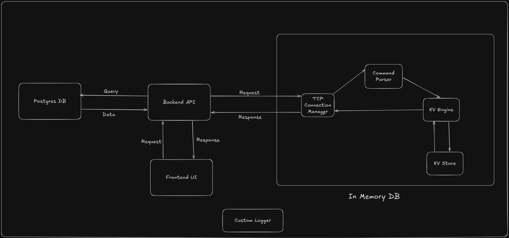

# In-Memory DB — Design

Go learning project: custom in-memory key-value database and a driver web application. Linux only.

**In Memory DB is complete and immutable** — protocol, engine, and TCP service are not changing. All new work is the driver web application and its integration with Postgres and the KV service.

**Purpose of the web application:** a manual CRUD test bed (not a product demo, not automated load simulation). The user performs create/read/update/delete operations by hand in the UI and compares latency with KV caching enabled vs Postgres alone. Repeated manual reads naturally show cold-cache (miss → PG) vs warm-cache (hit → KV) behavior. No authentication.

---

## System

Four components and one shared utility, as in the diagram:

| Component | Description |
|-----------|-------------|
| **Frontend UI** | HTML served by the Backend API; HTMX for partial updates; Pico.css for styling |
| **Backend API** | Go HTTP server in this repo (`cmd/api`) |
| **Postgres DB** | Persistent relational database; local instance via Docker Compose |
| **In Memory DB** | Standalone TCP service (`cmd/in-memory-db`) |
| **Custom Logger** | Shared logging package (`internal/logger`) used by Backend API and In Memory DB |

**Driver web application:** Frontend and Backend API are one integrated app in this repository. Postgres is the source of truth; the In Memory DB is a cache in front of it when caching is enabled.

### External interfaces

| From | To | Message |
|------|-----|---------|
| Frontend UI | Backend API | Request |
| Backend API | Frontend UI | Response |
| Backend API | Postgres DB | Query |
| Postgres DB | Backend API | Data |
| Backend API | In Memory DB | Request |
| In Memory DB | Backend API | Response |

---

## In Memory DB

Separate process. Entry point: `cmd/in-memory-db`. Default listen: `localhost:55555`.

Internal pipeline (diagram):

| Layer | Package | Role |
|-------|---------|------|
| TCP Connection Manager | `internal/transport/tcp` | Accept connections; read/write lines; return responses |
| Command Parser | `internal/parser` | Parse text commands |
| KV Engine | `internal/kv/engine` | Execute commands |
| KV Store | `internal/kv/store` | In-memory map; optional TTL; lazy expiry on read |

Flow: Request → TCP Connection Manager → Command Parser → KV Engine ↔ KV Store → KV Engine → TCP Connection Manager → Response.

Time source for TTL: `internal/timeprovider`.

### TCP protocol

One command per line (`\n`-terminated). One response per line.

**Commands**

| Command | Syntax |
|---------|--------|
| SET | `SET "key" VALUE "value"` |
| SET (TTL) | `SET "key" VALUE "value" TTL "seconds"` |
| GET | `GET "key"` |
| DELETE | `DELETE "key"` |
| CLEAR | `CLEAR` |

Quoted strings; escapes `\"` and `\\`. Keywords (`SET`, `VALUE`, `TTL`, …) are case-insensitive. Keys and values must be quoted.

**Responses**

| Outcome | Format |
|---------|--------|
| Success | `SUCCESS: <payload>` |
| Error | `ERROR: <message>` |
| Line too long | `ERROR: line too long` |
| Server at capacity | `ERROR: server busy` |

**Transport limits**

Server defaults (configurable):

| Rule | Limit |
|------|-------|
| Max line size | 64 KiB (65536 bytes) per command line, excluding the trailing `\n` |
| Read timeout | 30s per line read; no complete line in time → connection closed |
| Write timeout | 10s per response write |
| Idle timeout | 5m max connection lifetime from accept |
| Max connections | 256 concurrent clients; additional connects get `ERROR: server busy` then close |
| Shutdown | `SIGINT` / `SIGTERM` stops accept; in-flight requests have up to 10s to finish |

---

## Driver web application

Manual test bed. HTML forms for CRUD on a single Postgres-backed entity (e.g. rows with id, key, value). Each user action is one HTTP request; the API executes the operation and returns an HTMX partial with the result and updated metrics. No automated benchmark runner in the UI.

### KV toggle

| Mode | Behavior |
|------|----------|
| **PG only** (`with_kv=false`) | All CRUD goes directly to Postgres |
| **With KV** (`with_kv=true`) | Cache-aside: reads try KV first; writes go to Postgres and update or invalidate KV |

Toggle is a UI control (e.g. checkbox) passed on each request — session cookie or form field is fine. Same handlers in both modes; branch on the flag.

**Cache-aside per operation (with KV enabled):**

| Operation | Path |
|-----------|------|
| Create | INSERT Postgres → SET KV |
| Read | GET KV → on miss, SELECT Postgres → SET KV |
| Update | UPDATE Postgres → SET KV (or DELETE KV to invalidate) |
| Delete | DELETE Postgres → DELETE KV |

KV keys map to a stable string derived from the entity (e.g. row id). The KV protocol has no key enumeration; the UI does not browse the KV store — it only drives CRUD on the Postgres entity.

### Metrics

Displayed in the UI after every operation. Tracked in memory in the API process (no Postgres table for metrics).

| Metric | Description |
|--------|-------------|
| Last op latency | Wall-clock ms for the most recent request |
| Op type | create / read / update / delete |
| Cache hit/miss | On read, when KV is enabled |
| Running totals | Op count and average latency (optionally per op type) |
| Recent log | Last N operations (time, op, latency, hit/miss, mode) |

---

## Backend API

Entry point: `cmd/api`.

| Package | Role |
|---------|------|
| `internal/api/server` | HTTP routes; render templates; metrics state |
| `internal/api/db` | Postgres access; CRUD on the application entity |
| `internal/api/kvclient` | TCP client to In Memory DB |

Serves HTML templates and static assets (Pico.css). HTMX drives dynamic fragments without a separate frontend build.

Postgres holds the CRUD entity. KV operations go to the In Memory DB over TCP; the API does not embed the KV engine.

---

## Local runtime

Docker Compose runs **Postgres only** — a local instance isolated from any Postgres on the host. Copy `.env.example` to `.env` and set `POSTGRES_HOST_PORT` (default `5434`) so it does not clash with other Postgres instances. The API and In Memory DB run as local Go processes.

1. `cp .env.example .env` — local config (`.env` is gitignored)  
2. `docker compose up -d` — Postgres (container only)  
3. `go run ./cmd/in-memory-db` — In Memory DB  
4. `go run ./cmd/api` — Driver web app  

Module: `github.com/inv-hemanthb/in-memory-db` (Go 1.23).
